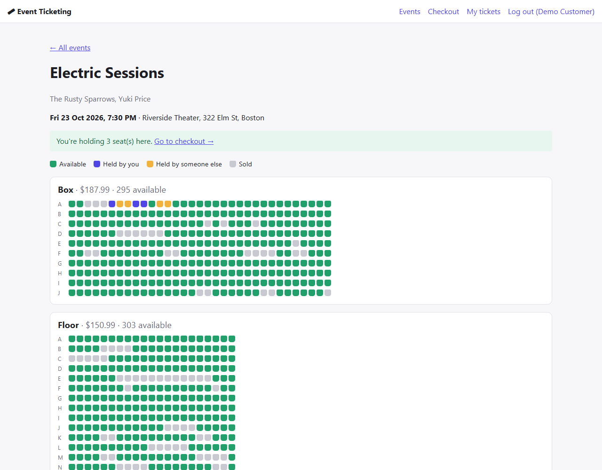
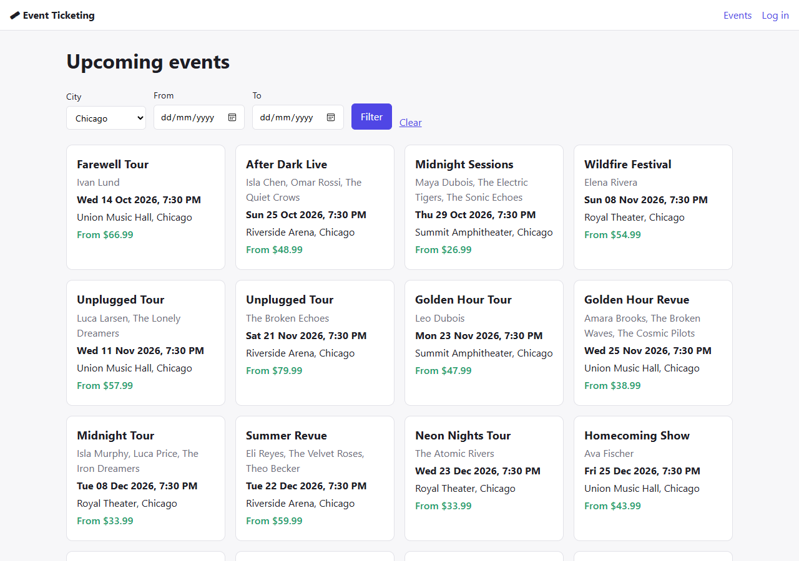
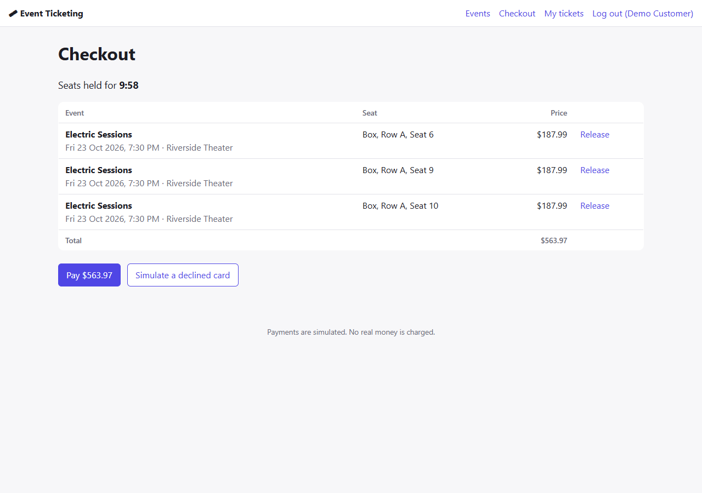
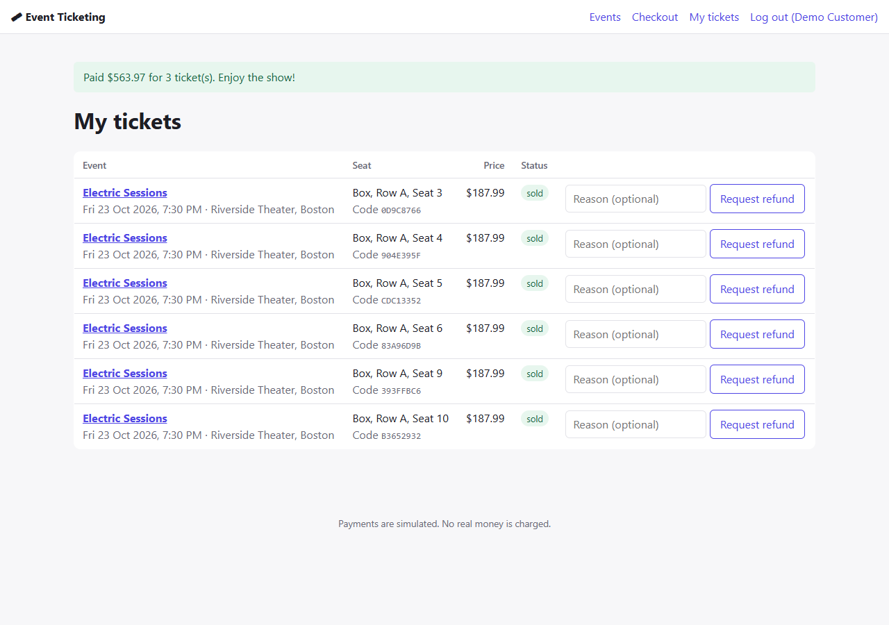
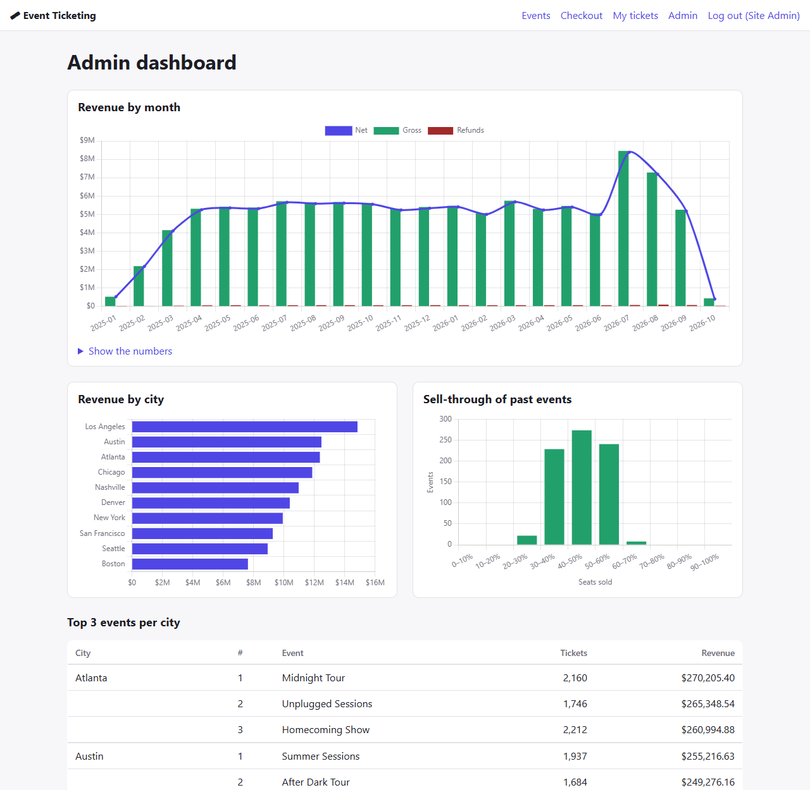
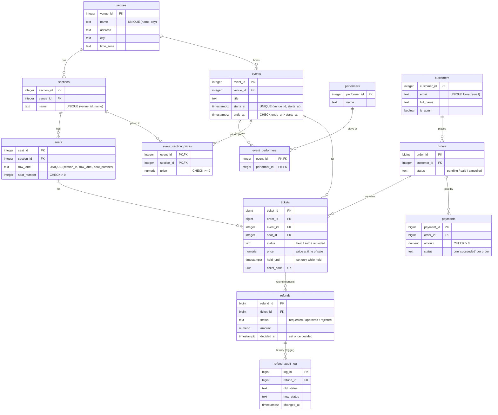

# Event Ticketing System

A concert and theater ticketing website built to learn databases deeply.
**PostgreSQL enforces the business rules**; the web layer (Node.js + Express + EJS) stays thin.

Customers browse events, pick seats on a live seat map, hold them for 10 minutes, pay (simulated)
and request refunds. Admins get a sales dashboard and a refund queue.

**At a glance:** 15 tables · 23 migrations · ~1M tickets, 100k customers of realistic seed data ·
a 50-buyer race test proving a seat can't be sold twice · before/after `EXPLAIN ANALYZE` for every query.



## Contents

- [Screenshots](#screenshots)
- [Database design](#database-design)
- [Concurrency: two people can never buy the same seat](#concurrency-two-people-can-never-buy-the-same-seat)
- [Indexes: before and after](#indexes-before-and-after)
- [Other measurements](#other-measurements)
- [Setup](#setup) · [Using the site](#using-the-site) · [Deploying to Render](#deploying-to-render-free) · [Backups](#backups) · [Scripts](#scripts)
- [What I learned](#what-i-learned)

## Screenshots

| | |
|---|---|
| **Home:** upcoming events, filtered by city and date  | **Checkout:** held seats with a 10-minute countdown  |
| **My tickets:** each ticket's code, refund requests  | **Admin dashboard:** revenue, cities, sell-through, refund queue  |

Seat map colours: green = available, blue = held by you, yellow = held by someone else, grey = sold.

## Database design



(Plus `sessions` for logins and `schema_migrations` for the migration runner. [Image version of the diagram](docs/database-diagram.png).)

**Design rules** (from `CLAUDE.md`): 3NF, a primary key on every table, a foreign key on every relationship
(all `ON DELETE RESTRICT`, except the pure link table `event_performers`), money as `numeric(10,2)`,
times as `timestamptz`, and business rules as constraints, not app code:

| Rule | How the database enforces it |
|---|---|
| A seat can be held or sold only once per event | **partial unique index** on `tickets (event_id, seat_id) WHERE status IN ('held', 'sold')`, so a refunded seat can be sold again |
| A held ticket has an expiry; a sold one doesn't | `CHECK ((status = 'held') = (held_until IS NOT NULL))` |
| One successful payment per order | partial unique index on `payments (order_id) WHERE status = 'succeeded'` |
| One open refund per ticket | partial unique index on `refunds (ticket_id) WHERE status IN ('requested', 'approved')` |
| Emails are unique regardless of capitalization | unique **expression index** on `lower(email)` |
| Every refund status change is logged | `AFTER INSERT OR UPDATE OF status` **trigger** on `refunds` |
| Unpaid holds are released after 10 minutes | **stored procedure** `release_expired_holds()`, called every minute |
| Prices are per event *and* section | its own table, `event_section_prices` (3NF), not a column on either |
| Nothing derivable is stored | no `venues.capacity`, no `orders.total`: they're counted/summed when needed |

`db/tests/constraints_test.sql` tries to break each rule (31 checks, all pass) inside a rolled-back transaction.

## Concurrency: two people can never buy the same seat

`npm run test:race` (`db/tests/race_test.js`) runs the **same `holdSeat()` / `payForOrder()` code the website uses**,
one database connection per buyer, all released at the same instant:

| Round | Scenario | Result |
|---|---|---|
| 1 | **50 buyers race for the last of 10 seats** | exactly **1** gets it (~250 ms), 49 are told it's taken, the event has exactly 10 sold tickets |
| 2 | the last seat's hold has expired; 49 buyers race for it | exactly **1** gets it; the original holder can no longer pay |
| 3 | the winner clicks "Pay" twice at the same moment | exactly **1** payment |

**The test can fail, which is the point:** with the partial unique index dropped, **all 50 buyers "got" the last seat
and the 10-seat event ended up with 59 sold tickets** (7 checks failed). With the index back, all checks pass.

How a hold works (`server/booking.js`, one transaction):
1. `SELECT ... FROM customers ... FOR UPDATE` serializes one customer's clicks (two tabs → one cart).
2. Check the seat belongs to the event's venue, and find or create the pending order.
3. Remove an expired hold on that seat, if the cleanup job hasn't yet.
4. `INSERT` the ticket. **The partial unique index is the referee**: a competing INSERT waits for the
   first transaction, then fails. There's no "check, then insert" gap to race through.

Paying locks the order and its holds with `FOR UPDATE`, so double clicks can't pay twice and the cleanup
job can't release seats in the middle of a payment.

**Try it by hand:** open the same event in a normal and a private browser window, log in as two different
emails, and click the same green seat in both. One gets "Seat held"; the other gets "Sorry, someone else just took that seat."

## Indexes: before and after

Measured with `npm run explain -- <file>` (`EXPLAIN (ANALYZE, BUFFERS)`, best of 3) on ~1M tickets.

| Query (`db/queries/`) | Before | After | What changed |
|---|---|---|---|
| 05 expired holds (cleanup job) | 100 ms | **0.11 ms** | partial index on `held_until WHERE status = 'held'` (16 kB) |
| 07 customer name prefix search | 33 ms | **0.07 ms** | `lower(full_name) text_pattern_ops` (the collation isn't `C`) |
| 06 open refund queue | 2.3 ms | **0.044 ms** | partial index already in `requested_at` order: no sort step |
| 09 revenue, last 30 days | 93 ms | **7 ms** | covering partial index → Index Only Scan, 0 heap fetches |
| 10 top 3 events per city | 348 ms | **~160 ms** | query rewrite (aggregate before join), **not** an index |

**Existing indexes, tested by dropping them inside a rolled-back transaction:**

| Query | With the index | Without |
|---|---|---|
| 02 seat map | 8.4 ms | 334 ms |
| 04 my tickets (`orders_customer_id_idx`) | 0.36 ms | 110 ms |
| 03 email lookup (`lower(email)`) | 0.02 ms | 41 ms if the query forgets `lower()` |

**Where indexes didn't help:** a 1,000-row table (01, 0.13 ms with a Seq Scan), and the dashboard totals
(08, 10–13) that read nearly every row. A 31 MB covering index on tickets was tested and the planner ignored it.

## Other measurements

| What | Result |
|---|---|
| Full seed (`COPY`) | ~1M tickets, 448k orders, 470k payments, 100k customers in **~100 s** (was 98–135 s with `INSERT ... SELECT`) |
| Small seed (`SEED_SCALE=0.1`) | ~107k tickets, 48 MB, in ~7–25 s |
| Backup (`pg_dump -Fc`) | 309 MB database → **28 MB** file in 7 s; restore into a copy in 10 s, 19/19 fingerprints match |
| Adding `ticket_code` to 1M tickets (migration 022) | batched backfill, `NOT VALID` + `VALIDATE`, `CREATE INDEX CONCURRENTLY`: no long locks, identical checksum before/after, race test passed **during** the backfill. The one-step version froze the table for 5.9 s |

## Setup

1. Install Node.js 20+ and PostgreSQL 17.
2. Create the database:
   ```
   createdb -U postgres ticketing
   ```
3. Copy `.env.example` to `.env`, put in your `postgres` password, and set `SESSION_SECRET`
   to any long random string.
4. Install dependencies and create the tables. `npm run migrate` applies every file in
   `db/migrations/` that hasn't run yet, and records it in the `schema_migrations` table:
   ```
   npm install
   npm run migrate
   ```
5. Load the sample data (~1M tickets, 100k customers, loaded with `COPY`, about 100 seconds).
   **This wipes all existing data first.**
   ```
   npm run seed
   ```
   For a smaller database, set `SEED_SCALE` between 0 and 1:
   ```
   SEED_SCALE=0.1 npm run seed             # Git Bash / macOS / Linux
   $env:SEED_SCALE="0.1"; npm run seed     # PowerShell
   ```
6. Optionally, check that every database rule works:
   ```
   psql -U postgres -d ticketing -f db/tests/constraints_test.sql
   npm run test:race
   ```
7. Start the server and open http://localhost:3000
   ```
   npm start
   ```

## Using the site

| Page | URL | What you can do |
|---|---|---|
| Home | `/` | Browse upcoming events; filter by city and date |
| Event | `/events/:id` | Seat map. Click a green seat to hold it for 10 minutes |
| Checkout | `/checkout` | See held seats with a countdown, release seats, pay (or simulate a declined card) |
| My tickets | `/my-tickets` | Your tickets and their codes; request a refund for future events |
| Admin | `/admin` | Revenue charts, top events per city, sell-through, refund queue (approve/reject) |

Logging in only needs an email (payments and accounts are simulated). A new email creates an account.
For the admin dashboard, log in as **admin@example.com**.

A background job runs every minute and calls the database procedure `release_expired_holds()` to release seats whose 10-minute hold has expired.

## Deploying to Render (free)

`render.yaml` is a Render Blueprint: it creates the web app **and** a PostgreSQL database.

1. Sign in at [render.com](https://render.com) with your GitHub account.
2. **New → Blueprint**, pick the `ticketing-system` repository, and click **Apply**.
3. Wait for the first deploy (a few minutes). On every start the app runs
   `npm run migrate` → seeds a small dataset **only if the database is empty**
   (`SEED_SCALE=0.1`: ~100k tickets, ~48 MB) → starts the server.
4. Open the `https://ticketing-system-….onrender.com` URL Render shows.
   Log in as `admin@example.com` for the dashboard.

Good to know about the free plan:
- The app **sleeps after 15 minutes without visitors**; the next visit takes about a minute to wake it.
- The free database **expires after 30 days** (Render emails you first). Take a backup if you want to keep it.
- Logins are stored in the database (`sessions` table), so they survive restarts.
- To seed or inspect the hosted database from your laptop, copy its **External Database URL** from Render and run, e.g.
  `DATABASE_URL="<external url>" DATABASE_SSL=true npm run migrate`.

## Backups

```
npm run db:backup                    # pg_dump -> backups/ticketing-<time>.dump (~28 MB, ~7 s)
npm run db:restore                   # restore the newest backup into "ticketing_restore" and compare it
npm run db:restore -- --drop-after   # same, then delete the copy
```
The restore never touches the live database: it restores into a separate one, then checks that row counts,
indexes, constraints, triggers, procedures, the total of all ticket prices and the next order ID all match.
`backups/` is git-ignored because dumps contain customer data.

## Scripts

| Command | What it does |
|---|---|
| `npm start` | Start the website on http://localhost:3000 |
| `npm run migrate` | Apply new migrations from `db/migrations/` |
| `npm run seed` | Wipe and reload sample data (`SEED_SCALE` 0–1 for less) |
| `npm run explain -- db/queries/<file>.sql` | Show a query's plan and timing (best of 3) |
| `npm run test:race` | 50 buyers race for one seat |
| `npm run db:backup` / `npm run db:restore` | Back up with `pg_dump`; restore into a copy and verify it |
| `npm run screenshots` | Retake the README screenshots (needs Edge or Chrome) |

## Project structure

```
db/
  migrations/   001–023, one schema change per file (never edited after running)
  seeds/        sample-data generator (SQL + JavaScript streaming with COPY)
  queries/      one analytics/page query per file, with measured timings at the bottom
  tests/        constraints_test.sql (31 rule checks), race_test.js (concurrency)
  ops/          backup and restore scripts
  migrate.js    the migration runner
  notes.md      what I learned in each phase
server/         Express app: routes stay thin (run SQL, render a page); booking.js holds the concurrency logic
views/          EJS pages
public/         CSS, seat map styles, checkout countdown, dashboard charts
docs/           screenshots
```

## What I learned

Each phase's lessons, with the measurements behind them, are in [db/notes.md](db/notes.md):
schema design and constraints, `COPY` bulk loading, reading `EXPLAIN ANALYZE`, partial/expression/covering
indexes, transactions and row locks (`FOR UPDATE`, `SKIP LOCKED`), triggers and procedures,
zero-downtime migrations, and backups that are actually tested.
